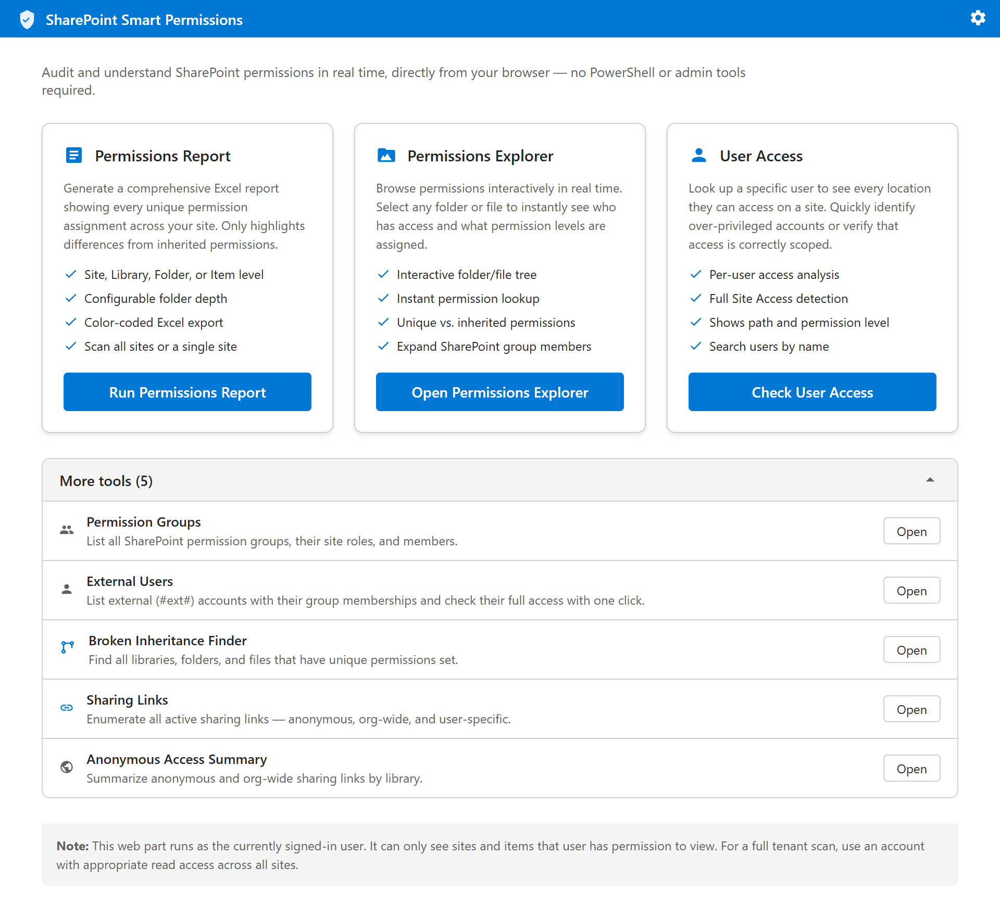
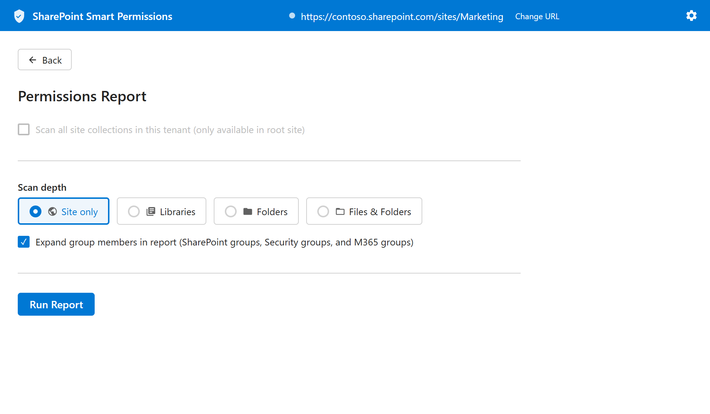
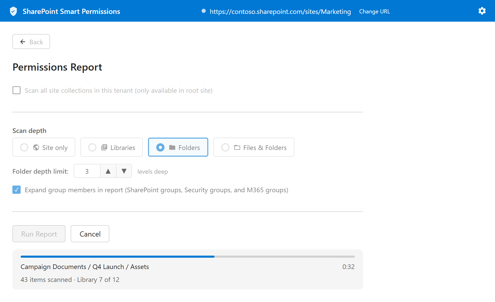
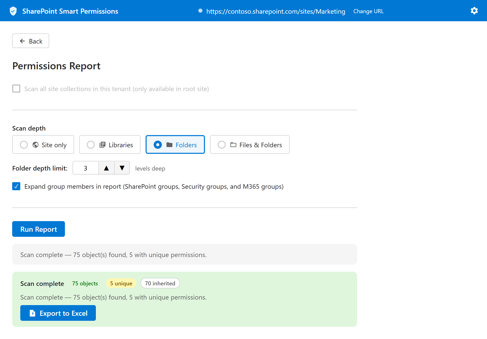
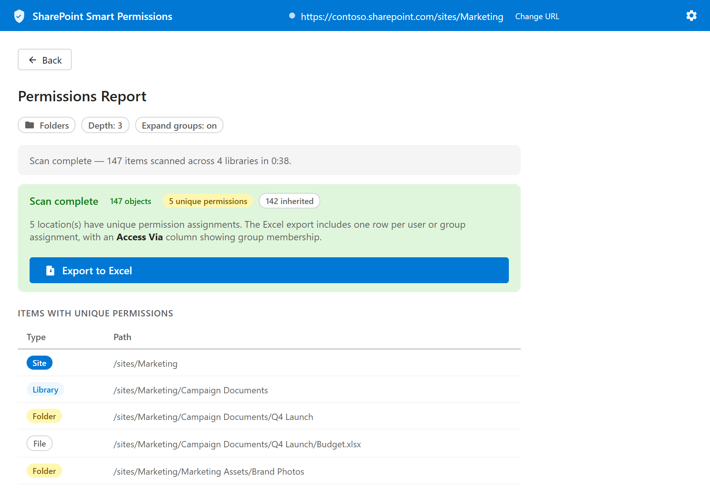
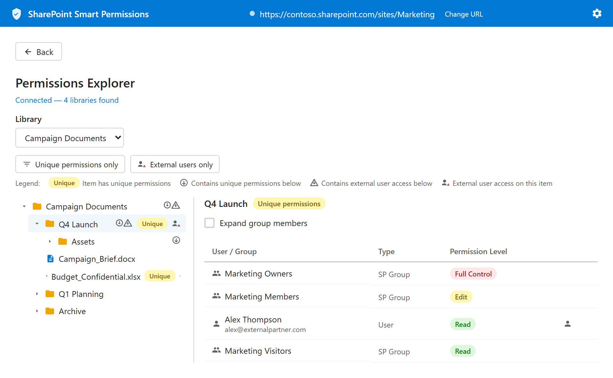
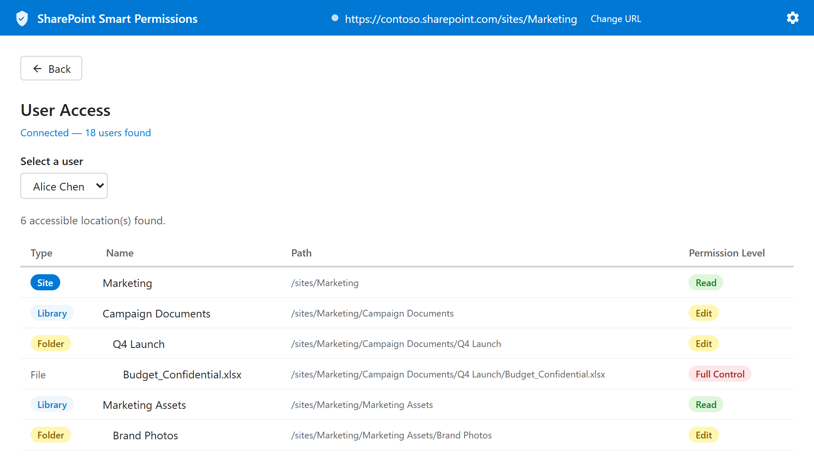
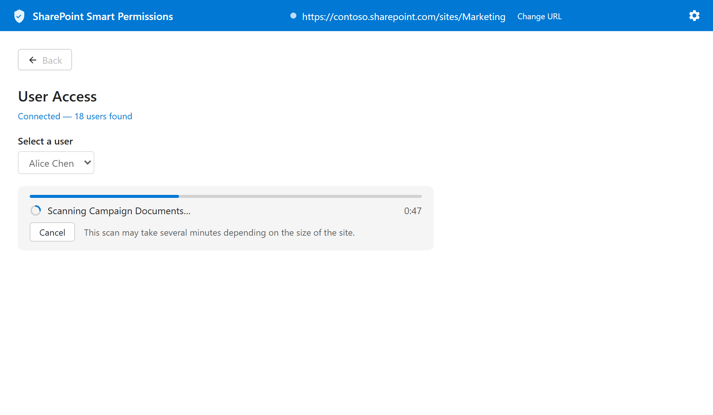
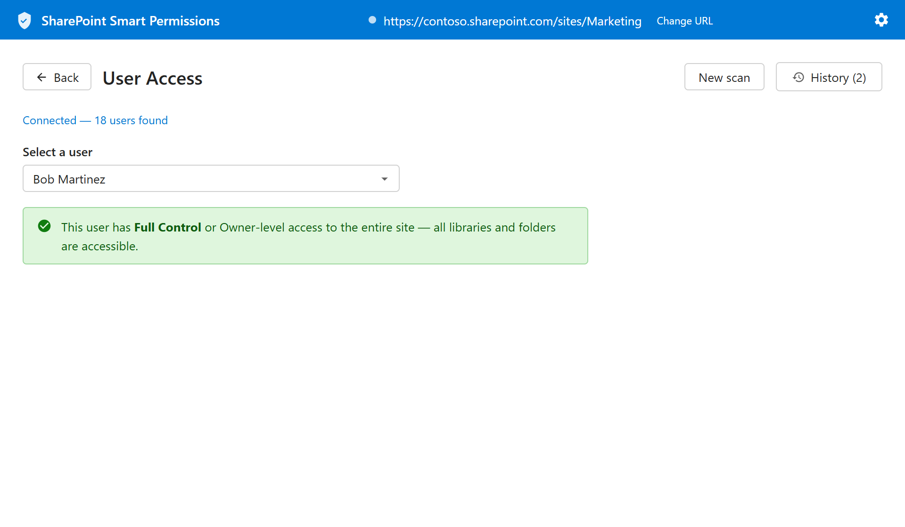
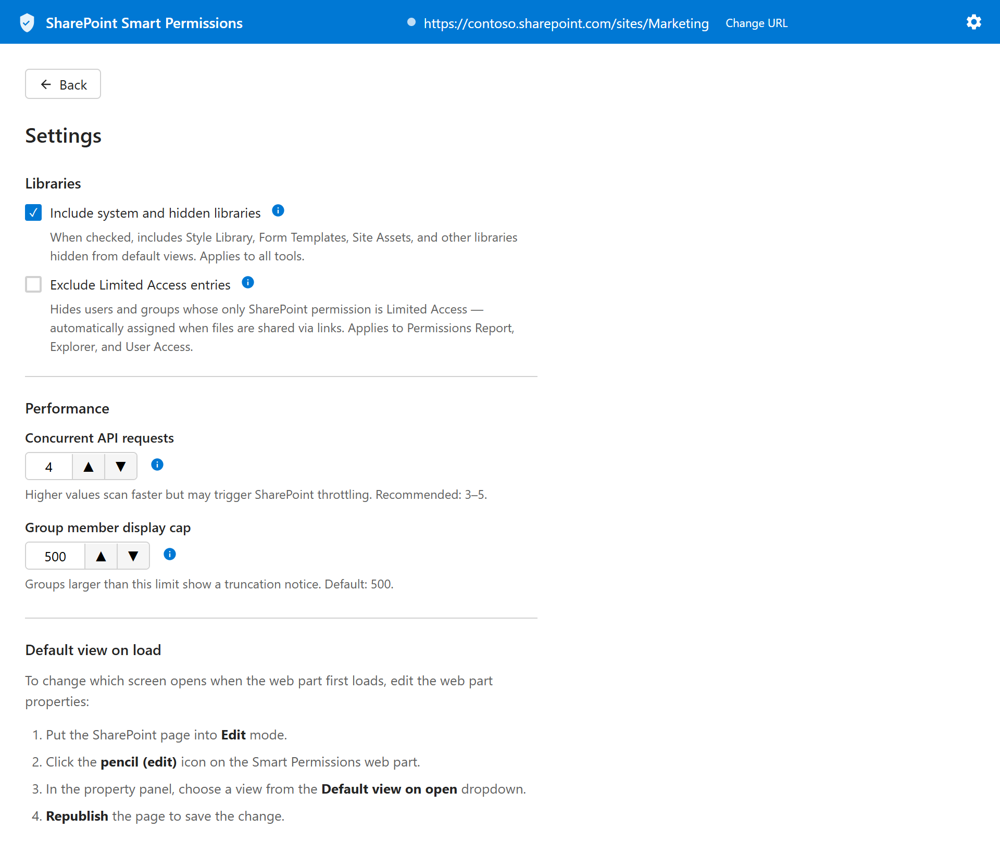

# SharePoint Smart Permissions — User Guide

**Version 1.5.0**
**Applies to:** SharePoint Online

---

## Table of Contents

1. [Overview](#overview)
2. [Who Is This For?](#who-is-this-for)
3. [Getting Started](#getting-started)
4. [The Home Screen](#the-home-screen)
5. [Permissions Report](#permissions-report)
6. [Permissions Explorer](#permissions-explorer)
7. [User Access](#user-access)
8. [Settings](#settings)
9. [Web Part Configuration](#web-part-configuration)
10. [Changing the Target Site](#changing-the-target-site)
11. [Security & Privacy](#security--privacy)
12. [Frequently Asked Questions](#frequently-asked-questions)
13. [Troubleshooting](#troubleshooting)
14. [Administrator: Tenant-Wide Provisioning](#administrator-tenant-wide-provisioning)

---

## Overview

**SharePoint Smart Permissions** is a browser-based auditing tool built directly into SharePoint Online as a web part. It gives site owners, administrators, and compliance teams a clear, real-time view of who has access to what — without requiring PowerShell, third-party software, or IT assistance.

SharePoint's default interface makes it difficult to understand the full picture of permissions across a site. Unique permission breaks are hidden deep in menus, group memberships are opaque, and there is no built-in way to ask "what can this specific user actually see?" SharePoint Smart Permissions solves all three problems from a single, easy-to-use interface.

### What You Can Do

| Tool | Purpose |
|------|---------|
| **Permissions Report** | Generate a full Excel report of every unique permission assignment across a site or the entire tenant |
| **Permissions Explorer** | Interactively browse a document library and inspect permissions on any folder or file in real time |
| **User Access** | Look up any user and see every location they can access, with their exact permission level at each location |

---

## Who Is This For?

- **Site Owners** who want to understand and clean up permissions on their sites
- **IT Administrators** performing periodic access reviews or compliance audits
- **Compliance Officers** who need documentation of who has access to sensitive content
- **Help Desk Staff** diagnosing "why can't this user see this file?" questions
- **Security Teams** identifying over-privileged accounts or verifying least-privilege access

> **Note:** The web part runs as the currently signed-in user. You can only see sites and content that your account has permission to view. To audit an entire tenant, use an account with read access across all sites.

---

## Getting Started

### Prerequisites

- You must be a **Site Owner** (or have the Manage Permissions right) on the site you want to audit. Reading role assignments — who has what access — requires this right. Anyone without Site Owner access (Members, Visitors, Limited Access users, and guests) will see the web part but the feature cards will be disabled.
- To run a full tenant scan, you need read access across all site collections (typically a Global Admin or SharePoint Admin account)

### Accessing the Web Part

The SharePoint Smart Permissions web part is added to a SharePoint page by a site administrator. Once added, simply navigate to the page where it has been placed.



When you first open the web part, you will see the **Home Screen** with the three main feature cards. The web part automatically connects to the current SharePoint site — no configuration is needed to get started.

---

## The Home Screen

The home screen is your starting point. A blue brand banner runs across the top, followed by three feature cards displayed side by side — one for each tool — each with a brief description and a launch button.


**Feature cards:**
- **Permissions Explorer** — for real-time interactive browsing
- **Permissions Report** — for generating exportable audit reports
- **User Access** — for per-user access lookups

Click any button to enter that tool. Use the **Back** button at the top left of any tool screen to return to the home screen.

The **gear icon** (⚙) in the top-right corner of the banner opens the global Settings panel on every screen, including the home screen.

### Member Access

If you open the web part without Site Owner access, a warning banner appears below the brand header and the three feature cards are grayed out and non-clickable. The banner reads:

> **Site Owner access required —** These tools require Site Owner access. Contact a site owner if you have questions about permissions.

This applies to anyone without the Manage Permissions right — Members, Visitors, Limited Access users, and guests. Only Site Owners and Site Collection Administrators can use the tools.

---

## Permissions Report

### What It Does

The Permissions Report scans a site's lists, libraries, folders, and files and produces a comprehensive view of every location where permissions differ from the site default. It focuses on **unique permission breaks** — places where someone has explicitly changed who can access a specific item. All visible lists are covered — generic lists, Site Pages, calendars, and task lists carry permissions too, not just document libraries — and you can optionally include every **subsite** below the site.

Once the scan is complete, you can browse the results directly in an **interactive table**, export them as a **color-coded Excel workbook** suitable for sharing with stakeholders or retaining for compliance records, or **compare** them against a previous scan to see exactly what changed.



### How to Use It

1. Click **Run Permissions Report** from the home screen.
2. Choose your **Scan Depth** — one of four options shown as a horizontal radio group:

   | Option | What Is Scanned |
   |--------|----------------|
   | **Site only** | The top-level site permissions only |
   | **Libraries** | All document libraries on the site |
   | **Folders** | All libraries and folders (configurable depth) |
   | **Files & Folders** | Everything — libraries, folders, and individual files |

3. If you select **Folders**, a **Folder depth limit** field appears. Use the spin button to set how many levels deep to scan (1–10).
4. **Expand group members in report** is checked by default. When checked, every SharePoint group, Security group, and M365 group that appears in a permission entry is expanded to list its individual members in the Excel output. Uncheck this if you only need the group names and not their membership. Expanding Security groups and M365 groups requires the optional `GroupMember.Read.All` Graph permission to be approved in your tenant — SharePoint groups expand without it.
5. If you are on the root site and have tenant-wide access, enable **Scan all site collections in this tenant** to audit the entire organization.
6. Enable **Include subsites** to recursively scan every subsite below the selected site. Subsites often break inheritance from the parent site, so include them for a complete audit. (In all-sites mode, subsites of every site collection are included.)
7. Click **Run Report**.



8. While the scan runs you will see:
   - A **progress bar** advancing library-by-library
   - The **name of the current item** being scanned
   - An **elapsed timer** (updated every half-second)
   - A running count of **items scanned** and **library N of N**
   - A **Cancel** button to stop the scan at any time

9. When the scan finishes, a green result panel appears showing the total object count, the number with unique permissions, a **results table**, and export buttons.



10. Browse the results directly in the table, or click **Export to Excel** to download a color-coded workbook.




### Browsing the Results

The results table appears below the filter bar after every scan:

- One row per scanned object, in natural scan order (site → library → folders). Click the **Type**, **Name**, **Path**, or **Permissions** header to sort; click again to reverse.
- Click any row (or its chevron) to **expand it** and see the full permission assignments for that object — every user and group with their color-coded permission level.
- A **Unique** badge marks objects with broken inheritance; **Inherited** marks the rest.
- A **Hidden from search** badge marks libraries an admin has excluded from search indexing (NoCrawl) — worth a closer look during an audit, since that setting is sometimes used to keep sensitive content out of sight.
- The filter box and the **Unique permissions only** / **External users only** checkboxes filter the table and the exports together.
- Large results paginate at 200 rows — click **Load more** for the rest.
- **"Everyone" and "Everyone except external users"** claims are highlighted in red as tenant-wide access, both in the table and in the Excel export, so a broad grant doesn't blend in as an ordinary group row.
- If a temporary network or throttling error prevents an item from being fully read even after retries, it's flagged with a warning banner instead of being silently shown with its parent's permissions. Re-run the scan to retry those items.

### Understanding the Excel Export

The Excel export contains one row per scanned object. Key columns include:

- **Type** — Site, Library, List, Folder, or File
- **Name** — The display name of the object (with a "(hidden from search)" marker for NoCrawl libraries)
- **Path** — The server-relative URL
- **Has Unique Permissions** — Yes/No indicator
- **Users / Groups** — Everyone who has been explicitly granted access
- **Permission Level** — The role assigned (Full Control, Edit, Read, etc.)

Rows for items with **unique permissions** are highlighted in the Excel workbook so they stand out immediately.

### Report History and Compare

Every completed scan is saved automatically to a local history log in your browser. Click the **History** button in the header to see past reports with their date, site, scope, and object counts. From there you can **Export** any past report without re-scanning, or **Delete** records.

To see **what changed between two scans**, tick the checkboxes next to two reports and click **Compare selected**. The comparison shows:

- **Permission changes** — users or groups added, removed, or given different roles on each object
- **Inheritance changes** — objects whose inheritance was broken or restored
- **New / removed objects** — items that appeared in or disappeared from the scan

Run a scan on a schedule (for example, monthly) and compare against the previous one to turn the report into a change log of your site's permissions. A warning appears if the two reports were taken with different sites or scan options, since differences may then reflect settings rather than real changes.

### Cancelling a Long Scan

Click the **Cancel** button that appears next to the progress bar. The scan stops and everything collected so far is kept — the results table and both export buttons work on the partial results, and the header clearly marks them as *"Scan cancelled — partial results."* Cancelled scans are not saved to history.

---

## Permissions Explorer

### What It Does

The Permissions Explorer lets you browse a document library interactively — folder by folder, file by file — and see the live permissions on any item instantly. It is ideal for investigating a specific area of a site rather than producing a full report.



### How to Use It

1. Click **Open Permissions Explorer** from the home screen.
2. The web part automatically connects to the site and loads the available document libraries (including Site Pages and picture libraries). Libraries an admin has excluded from search indexing are marked **"(hidden from search)"** in the dropdown.
3. Use the **Library** dropdown to select the library you want to browse.
4. The **left panel** shows the folder and file tree. Click any item to select it.
5. The **right panel** shows the permissions for the selected item.

The tree is fully keyboard accessible: **Tab** into it, then use **Up/Down** arrows to move between items, **Right** to expand a folder, **Left** to collapse it (or jump to the parent), **Home/End** to jump to the first or last item, and **Enter** or **Space** to select the focused item.

### Understanding the Permission Panel

When you select an item, the right panel shows:

- The **item name** and a badge indicating whether it has **Unique permissions** (amber) or **Inherited** permissions (blue)
- An **options bar** at the top of the panel (always visible) with:
  - **Expand SharePoint group members** — reveals the individual users inside each SharePoint group
  - **Show parent permissions** — visible only for inherited items; shows where the permissions come from
- For **inherited items**, a blue callout banner — with a chain-link icon — reads *"This item inherits permissions from its parent."*
- For **unique items**, a permissions table listing every user and group with access


Color-coded permission badges: **red** for Full Control, **amber** for Edit/Contribute, **green** for Read/View.

**"Everyone" and "Everyone except external users"** claims are highlighted in red as tenant-wide access rather than appearing as an ordinary group row, since a grant to either of these claims effectively opens the item to the whole organization (or the whole internet, for external sharing links).

### Expand Group Members

Check **Expand group members** in the options bar to expand each SharePoint group, Security group, or M365 group and show the individual users inside it. This is useful when you need to see exactly which people are covered by a group assignment. Note: expanding Security groups and M365 groups requires the optional `GroupMember.Read.All` Graph permission to be approved in your tenant — SharePoint groups expand without it.

Toggling this option refreshes the permissions panel in place — if you were already showing parent permissions, those are refreshed too.

### Show Parent Permissions

For items that **inherit** permissions, check **Show parent permissions** to immediately see where those permissions come from. The panel will display the permissions of the nearest ancestor that has unique permissions, labelled *"Inherited from: [name]"*.

### Finding Items of Interest Quickly

Visual indicators in the tree help you navigate to security-relevant items without expanding every folder manually:

- **Amber "Unique" badge** — the item itself has unique permissions
- **Circle arrow-down** — the folder contains items with unique permissions below
- **Triangle arrow-down** — the folder contains items with external user access below
- **Circle and triangle arrow-down together** — the folder contains items with both unique permissions and external user access below

Hover over any arrow icon to see a tooltip describing what is present below.

### External User Detection

As soon as a library loads, the Explorer runs a **background scan** that checks every item with unique permissions for external accounts. No clicking is required — the warning icons appear automatically within a few seconds of the library loading, and continue to appear as you expand folders.

A **red warning-person icon** on a tree node means the item has **unique permissions** that explicitly grant access to an external account. Folders that contain external-access items somewhere below them show a triangle arrow-down icon; folders with both external access and unique-permission items below show the circle and triangle icons together — the warning icon is reserved for the location where access was actually granted, so you can act on it directly.

When you click an item and the permissions panel opens, external users show both their **display name** and their **decoded email address** (extracted from the SharePoint `#EXT#` login format) so you can identify them at a glance.

> **Note:** External users inside SharePoint groups are only shown when **Expand group members** is also enabled.

### Filtering for External Users

Click the **External users only** toggle button (person with warning icon) in the toolbar above the tree to filter the **tree** to show only folders and files where external users have access — this works exactly like the **Unique permissions only** filter.

When active:
- The tree shows only items with external user access (direct or inherited) and their ancestor folders
- The permissions panel for the selected item also shows only external-user rows
- If the selected item has no external users, a message appears instead of an empty table

Toggle it off to return to the full tree view.

### Permission Limitations for Members

The Permissions Explorer runs as the signed-in user and can only read what that user has access to. Reading **role assignments** (who has what permission on an item) requires the **Manage Permissions** right, which site owners and administrators have but regular members typically do not.

If your account does not have Manage Permissions, a blue information banner appears when the library loads:

> *"Some permission details are not visible — reading role assignments requires the Manage Permissions right (site owner or higher). External user indicators and permission tables may be incomplete for your account."*

In this state:
- The folder and file tree loads normally
- Unique vs. inherited permission badges still appear where detectable
- External user warning icons and permission tables are unavailable
- No data is missing silently — the banner tells you exactly what is limited

To see the full picture, use an account with Site Owner or Site Collection Administrator access.

### Tree Legend

A legend below the toolbar explains the visual indicators:

| Indicator | Meaning |
|-----------|---------|
| Amber **Unique** badge | Item has unique permissions |
| **Circle** arrow-down | Folder contains items with unique permissions below |
| **Triangle** arrow-down | Folder contains items with external user access below |
| **Circle and triangle** arrow-down together | Folder contains items with both unique permissions and external user access below |
| Red warning-person icon | External user access is explicitly granted on this item (unique permissions) |

---

## User Access

### What It Does

User Access answers the question: *"What can this specific person actually see?"* Select any user on the site and the tool scans every library, folder, and file to find every location they have explicit access — showing their exact permission level at each one.



### How to Use It

1. Click **Check User Access** from the home screen.
2. The web part loads the list of users on the site.
3. Start typing in the **Select a user** search box to filter by name or email address, then select the user from the dropdown. The scan begins automatically once a user is selected.
4. Once you have typed **3 or more characters**, the dropdown also searches the **whole tenant** and shows matches under a **"Not in this site"** group. This finds people who have access through a Microsoft 365 or security group but have never visited the site — they don't appear in the site's own user list, yet they may still have access worth checking.
5. A progress bar, elapsed timer, and status message show the scan's progress.



6. Once complete, a table shows every location the user can access.
7. A **New scan** button appears in the header — click it to clear the results and select a different user.

### Cancelling a Scan

Because User Access scans every folder and file on the site, it can take several minutes on large sites. Click the **Cancel** button while the scan is running to stop it and see partial results.

### Exporting Results

Two export formats are available once a scan completes:

- **Export to Excel** — a color-coded `.xlsx` workbook suitable for sharing with stakeholders or retaining for compliance records
- **Export to CSV** — a plain comma-separated file compatible with any spreadsheet or data tool

Both buttons appear in the top-right of the results area.

### Understanding the Results

The results table shows one row per accessible location:

| Column | Description |
|--------|-------------|
| **Type** | Site, Library, List, Folder, or File |
| **Name** | Display name of the location (indented to reflect hierarchy) |
| **Path** | Server-relative URL |
| **Permission Level** | The user's effective role at this location |

Click any column header to sort the table by that column; click again to reverse the order. On very large sites the table paginates at 200 rows — click **Load more** to show additional results.

Permission level badges use the same color coding as the Permissions Explorer (red = Full Control, amber = Edit, green = Read).

When a user has site-level access, an information banner appears explaining that only locations with **unique permission assignments** are listed — all other content is accessible through the site-level permission shown at the top of the list.

On a Microsoft 365 Group-connected site, if a Graph permission error prevents the tool from confirming whether the user is an Owner or Member of the group, the result shows **"Graph permission required"** rather than guessing. Approving the optional `GroupMember.Read.All` Graph permission (see [Expand Group Members](#expand-group-members)) resolves this.

### Scan History

Every completed scan is saved automatically to a local history log stored in your browser. Click the **History** button in the header to open the history panel, which shows a table of past scans with the date, user, site, and accessible location count. From the history panel you can:

- **Export** any past scan to Excel without re-running it
- **Delete** individual records from the log

History is stored in the browser's IndexedDB and persists across sessions on the same device and browser.

### Full Site Access

If a user has Full Control or Owner-level access at the site level, the tool detects this immediately and displays a **green confirmation message**: *"This user has Full Control or Owner-level access to the entire site — all libraries and folders are accessible."*



Individual item listing is not shown for owner-level accounts because they can access everything.

---

## Settings

The **Settings** page is accessible from the gear icon (⚙) in the top-right corner of the banner on every screen, including the home screen. Clicking the gear opens a dedicated full-page settings view with a **Back** button to return to where you were.



### Include System and Hidden Libraries

When this option is **unchecked** (the default), the Permissions Explorer and User Access tools only show standard document libraries — the ones users typically see and interact with.

When **checked**, the tools also include system and hidden libraries such as:
- Style Library
- Form Templates
- Site Assets
- Pages
- Other libraries hidden from default views

This setting is useful during a thorough security audit where you need to account for all content, including system-managed locations. Applies to all tools, including the Permissions Report.

> **Note:** Libraries marked **NoCrawl** (hidden from search results) are always included and flagged with a "hidden from search" marker — they are not treated as system libraries, because hiding content from search is sometimes used to obscure sensitive material.

### Exclude Limited Access Entries

When this option is **checked**, users or groups that hold only **Limited Access** on an item are hidden from permission tables. Limited Access is a system-assigned permission level that SharePoint grants automatically when a user has access to a specific item but not the parent folder or library — it grants no meaningful rights on its own and creates noise in large permission sets.

Enabling this option produces a cleaner view focused on permissions that were explicitly assigned.

### Performance

The **Performance** section controls how aggressively the tools scan in parallel.

| Setting | Default | Description |
|---------|---------|-------------|
| **Concurrent requests** | 4 | How many API requests are sent simultaneously during Permissions Report scans, User Access scans, and Explorer background checks. A higher number speeds up scans on large sites but may hit SharePoint throttling limits. |
| **Group member cap** | 500 | Maximum number of members fetched per group when **Expand group members** is enabled. Groups larger than this cap are shown but their member list is truncated. |

Reduce **Concurrent requests** if you see throttling errors during long scans. Reduce **Group member cap** if expanding large security groups causes timeouts.

### Default View on Load

The Settings page also shows step-by-step instructions for changing which screen the web part opens on by default. This is configured through the SharePoint web part property pane — see [Web Part Configuration](#web-part-configuration) for the full walkthrough.

---

## Web Part Configuration

Site administrators can configure the web part's default behavior through the SharePoint property pane.

### Setting a Default View

By default the web part opens on the **Home** screen. You can change this so it opens directly on one of the primary tools — useful when the web part is placed on a dedicated audit page.

**To change the default view:**

1. Navigate to the SharePoint page where the web part is installed.
2. Put the page into **Edit** mode (click the pencil icon or **Edit** in the top bar).
3. Click anywhere on the web part, then click the **Edit web part** pencil icon that appears on the web part's left edge.
4. The property pane opens on the right. Under **General**, locate the **Default view on open** dropdown.
5. Choose one of:
   - **Home** — shows the home screen with the three feature cards *(default)*
   - **Permissions Report** — opens directly on the report configuration screen
   - **Permissions Explorer** — opens directly on the explorer with library picker
   - **User Access** — opens directly on the user access lookup screen
6. Click **Apply** (or close the pane), then **Republish** the page to save the change.

> **Tip:** If the web part is used by a team that exclusively runs permission reports, setting the default view to **Permissions Report** eliminates one click on every visit.

---

## Changing the Target Site

By default, the web part connects to the SharePoint site where it is installed. The connected site URL is always visible in the blue banner at the top of every tool screen.

To audit a **different site**:

1. Click **Change URL** in the banner at the top of any tool screen.
2. Type or paste the full URL of the target site (e.g., `https://contoso.sharepoint.com/sites/finance`).
3. Press **Enter** or click **Connect**.

The web part will reconnect to the new site. All tools will now operate against that site until you change it again or navigate back to the home screen and return.

> **Important:** You must have Site Owner access (or the Manage Permissions right) on the target site. If your account does not have sufficient permission, the tools will not be able to read role assignments.

---

## Security & Privacy

### How It Works

SharePoint Smart Permissions runs entirely inside your browser as a SharePoint web part. It makes direct calls to the **SharePoint REST API** using your signed-in credentials — the same API that SharePoint itself uses.

### Key Security Properties

| Property | Detail |
|----------|--------|
| **No elevated permissions** | The tool uses only your existing access rights. It cannot see anything you cannot already see. |
| **Read-only** | The tool never creates, modifies, or deletes any SharePoint content or permissions. It only reads. |
| **No external services** | All data stays within your Microsoft 365 tenant. Nothing is sent to any external server or third-party service. |
| **No data storage** | Results exist only in your browser session. Closing the tab or navigating away clears everything. |
| **Standard authentication** | Authentication is handled entirely by SharePoint and Microsoft 365. The web part never handles passwords or tokens directly. |

### What the Tool Can See

The tool can only access sites, libraries, folders, and files that **your account** has permission to view. If you do not have access to a library, it will not appear in results.

### Compliance Considerations

Because the tool produces no audit trail of its own, access reviews performed with it should be documented separately (e.g., by retaining the exported Excel reports with a date and the name of the reviewer).

---

## Frequently Asked Questions

**Q: Do I need any special permissions to use this tool?**
A: Yes — you must be a **Site Owner** or have the **Manage Permissions** right on the site. All three tools read SharePoint role assignments, which requires this permission level. Anyone without that right — Members, Visitors, Limited Access users, and guests — will see the web part but the feature cards will be disabled. To audit an entire tenant, you additionally need read access across all site collections (typically a Global Admin or SharePoint Admin account).

---

**Q: Will using this tool change any permissions or affect other users?**
A: No. The tool is entirely read-only. It never modifies any SharePoint settings, permissions, or content.

---

**Q: Why does the User Access scan take several minutes?**
A: SharePoint's REST API does not provide a single call that returns all permissions for a user. The tool must inspect each library, folder, and file individually. On a large site with many libraries and deeply nested folders, this can take a significant amount of time. You can cancel at any time and see partial results.

---

**Q: Why can't I see some libraries in the Permissions Explorer?**
A: By default, hidden and system libraries are excluded (Style Library, Form Templates, Site Assets, etc.). Enable **Include system and hidden libraries** in Settings to show them.

---

**Q: What does "Inherited permissions" mean?**
A: SharePoint permissions flow down from parent objects. When an item shows "Inherited" (indicated by the blue banner with a chain-link icon), it means it uses the same permissions as its parent folder, library, or site — no unique permission assignment has been made for that specific item.

---

**Q: What is a "unique permission break"?**
A: A unique permission break occurs when a specific item (library, folder, or file) has had its permissions explicitly changed, making them different from the parent. This is also called "breaking inheritance." The Permissions Report and Explorer both identify and highlight these breaks with an amber **Unique permissions** badge.

---

**Q: Can I see what permissions an inherited item is using without checking the parent manually?**
A: Yes. Select the item in the Permissions Explorer, then check **Show parent permissions** in the options bar. The panel will immediately show the permissions of the nearest ancestor that has unique permissions, labelled *"Inherited from: [name]"*.

---

**Q: If I toggle "Expand group members", will it lose the parent permissions I was viewing?**
A: No. Toggling "Expand group members" refreshes the permissions in place — if parent permissions were already showing, they are re-fetched with the updated expansion setting automatically.

---

**Q: Can I scan a different site than the one I'm on?**
A: Yes. Click **Change URL** in the banner and enter the URL of any site you have access to.

---

**Q: Can I scan the entire tenant at once?**
A: Yes, but only from the root site (e.g., `https://contoso.sharepoint.com`) and only if your account has read access across all site collections. Enable **Scan all site collections in this tenant** in the Permissions Report settings.

---

**Q: The Excel export — can I share it with someone who doesn't have SharePoint access?**
A: Yes. The exported Excel file is a standard `.xlsx` file. It contains a snapshot of permissions at the time of the scan and can be shared freely. It contains no live links to SharePoint.

---

**Q: Why does the tool show a "Full Control" message for some users instead of listing their locations?**
A: If a user has Full Control or Owner-level access at the site level, they can access every item on the site. Rather than listing thousands of rows, the tool detects this and shows the full-access confirmation message instead.

---

**Q: Is my data secure when I use this tool?**
A: Yes. The tool communicates only with your own SharePoint environment via the standard Microsoft 365 REST API. No data is sent to any external server. See the [Security & Privacy](#security--privacy) section for full details.

---

## Troubleshooting

### "Connection failed" when opening a tool

- Confirm you have Site Owner access (or the Manage Permissions right) on the site.
- Check that the site URL is correct (no trailing slash, correct domain).
- Ensure your Microsoft 365 session is still active (try refreshing the page).

### Scan completes but shows 0 results

- You may not have sufficient permissions to read library metadata.
- The site may genuinely have no libraries (unlikely but possible for new sites).
- Try enabling **Include system and hidden libraries** in Settings.

### Export to Excel button is greyed out

- The export button is only active after a scan has completed successfully. Run the scan first.

### The scan seems to hang on one library

- Large libraries with thousands of items can take time. The status message and elapsed timer update as each item is processed.
- If it remains stuck for more than a few minutes, click **Cancel** and try a narrower scan scope (e.g., **Libraries** instead of **Files & Folders**).

### "You do not have permission" errors in the browser console

- Your account does not have sufficient access to some areas of the site. Results for those areas will be omitted. This is expected behavior — the tool only reports what it can see.

### Some system libraries (Style Library, Form Templates) still appear

- Ensure **Include system and hidden libraries** is unchecked in Settings.
- These libraries are excluded by URL pattern as well as their metadata flags. If they still appear, check that you are running the latest version of the web part package.

### A User Access result looks wrong and you need more detail

- Open the browser console and run `localStorage.setItem('smartPermissionsDebug', '1')`, then re-run the scan. Step-by-step diagnostic messages for that user's access resolution will appear in the console.
- Set the key to any other value (or remove it) to turn this logging back off.

---

## Administrator: Tenant-Wide Provisioning

For organizations that want to make Smart Permissions available on every site collection, the included PowerShell script automates the creation of a **Permissions.aspx** page with the web part pre-added across all sites in the tenant.

### Prerequisites

- The **Smart Permissions** app must already be deployed to the tenant App Catalog. Ticking "Make this solution available to all sites automatically" during upload is **not required** — the script installs the app on each site automatically as it goes (see [What the Script Does](#what-the-script-does)).
- The **PnP.PowerShell** module must be installed on the machine running the script:
  ```powershell
  Install-Module PnP.PowerShell
  ```
- The account used must have **SharePoint Administrator** or **Global Administrator** permissions.
- On tenants that reject the default PnP Management Shell app during interactive sign-in, register your own Entra ID app (via `Register-PnPEntraIDAppForInteractiveLogin`) and set `$clientId` in the script — see Configuration below.

### Script Location

The script is located at `scripts/Provision-SmartPermissions.ps1` in the solution repository.

### Configuration

Open the script and set the variables at the top:

```powershell
$adminUrl      = "https://contoso-admin.sharepoint.com"
$targetSiteUrl = ""   # leave empty to run across all sites
```

| Variable | Default | Description |
|----------|---------|-------------|
| `$adminUrl` | *(empty)* | Your SharePoint admin center URL. Only required in tenant-wide mode (when `$targetSiteUrl` is empty). |
| `$targetSiteUrl` | *(empty)* | Set to a single site URL to provision only that site. Leave empty to provision all sites in the tenant. |
| `$clientId` | *(empty)* | Optional Entra ID app client id, for tenants that reject the default PnP Management Shell app during interactive sign-in. |
| `$componentId` | Pre-filled | The Smart Permissions web part ID |
| `$pageName` | `Permissions` | File name of the created page (without `.aspx`) |
| `$pageTitle` | `Permissions` | Display title shown at the top of the page |
| `$webPartProps` | `defaultView: home` | Web part property defaults |

### Running the Script

**To provision a single site:**
1. Set `$adminUrl` and `$targetSiteUrl` in the script.
2. Run the script:
   ```powershell
   .\scripts\Provision-SmartPermissions.ps1
   ```

**To provision all sites tenant-wide:**
1. Set `$adminUrl` and leave `$targetSiteUrl` empty.
2. Run the script. You will be prompted to sign in to the admin center, then once per site.
3. Sites that fail (e.g. locked, no-script sites) are logged as warnings and skipped.

### What the Script Does

For each site collection:
1. Connects to the site
2. Checks whether the Smart Permissions app is already installed on the site and, if not, installs it from the tenant App Catalog automatically (waiting for the install to complete before continuing)
3. Checks whether `Permissions.aspx` already exists — if so, skips page creation and adds the web part to the existing page
4. Adds the Smart Permissions web part with default properties (skipped if it's already on the page — see Re-Running Safely below)
5. Publishes the page
6. Breaks permission inheritance on the page and grants Full Control to the site Owners group only — Members and Visitors cannot access the page
7. Adds the page to the site's Quick Launch navigation (scoped to the Owners group on Microsoft 365 Group-connected sites)
8. On M365-connected sites: enables audience targeting on the Site Pages library and sets the Owners group as the page audience

### Re-Running Safely

The script is idempotent — running it again on a site it has already provisioned is safe and won't create duplicates:
- If `Permissions.aspx` already exists, page creation is skipped and the existing page is reused.
- If the Smart Permissions web part is already on the page, it isn't added again.
- The Quick Launch navigation node is matched by both title and URL before being replaced, so it isn't duplicated either.
- Audience targeting and the Owners-only permission grant are re-applied each run, which is harmless (they simply reset to the same state).

This means you can safely re-run the script tenant-wide at any time — for example, after creating new sites — without needing to filter `$sites` down to only the new ones first.

---

*SharePoint Smart Permissions is a browser-based utility that runs within your Microsoft 365 environment. It does not store, transmit, or log any data outside of your browser session.*
